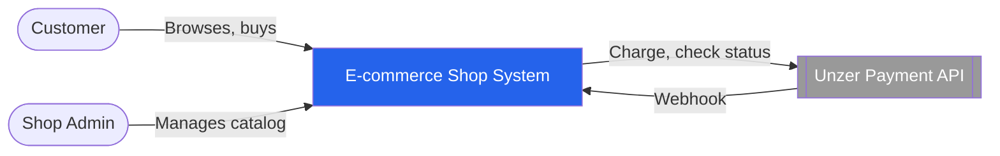
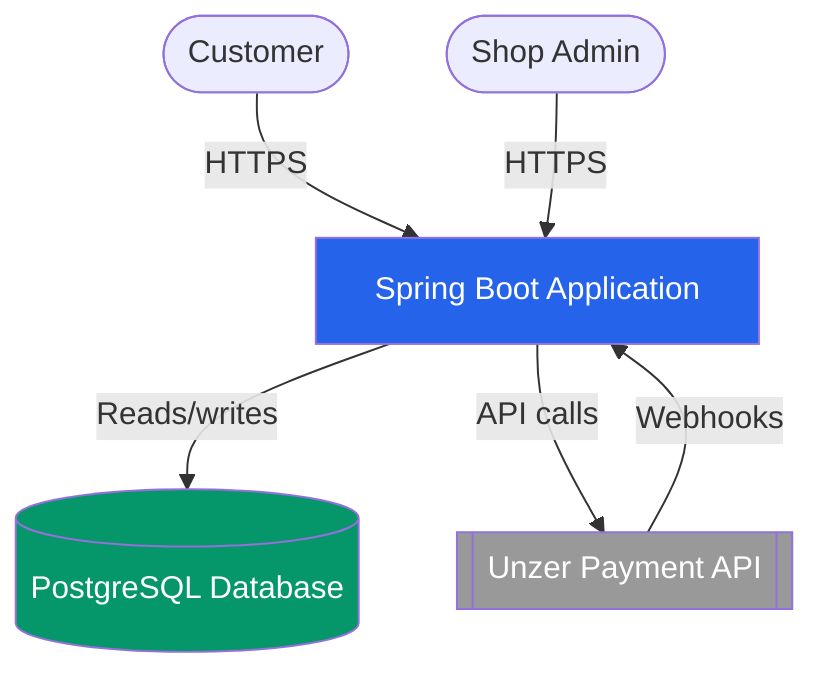
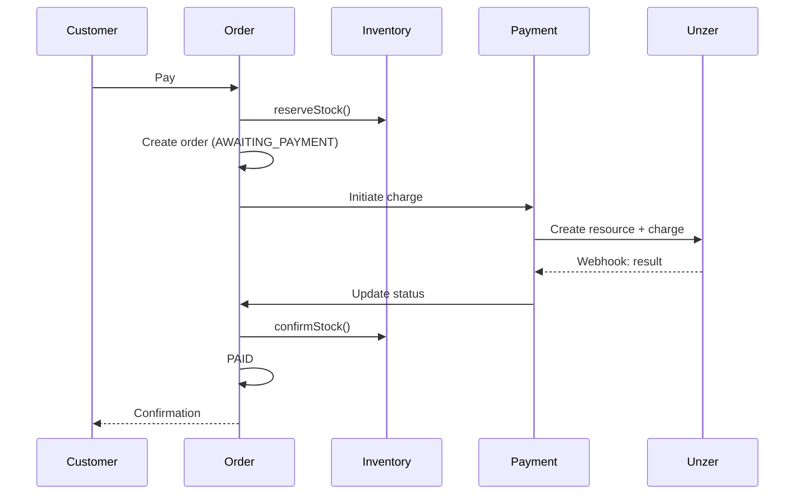
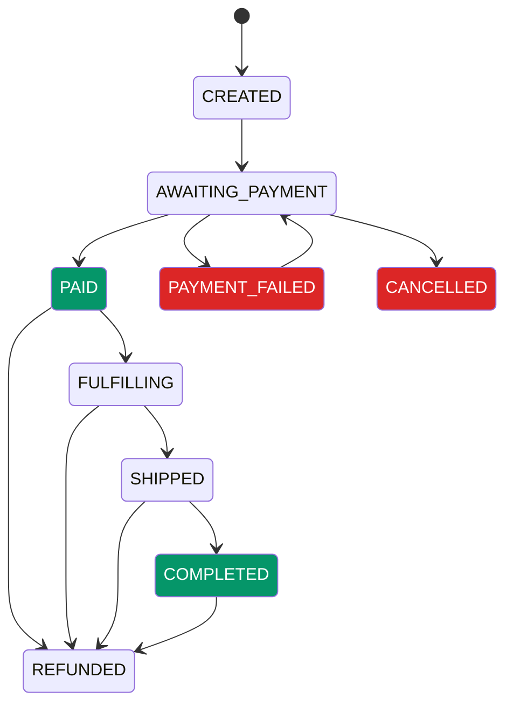
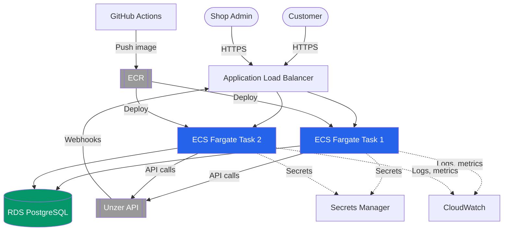

# Architecture Document: Unzer E-Commerce Shop

## 1. Overview & assumptions

This document architects a full e-commerce backend covering catalog, cart, checkout, orders, inventory, and customers, with Unzer as the payment subsystem (Credit Card, Wero, Open Banking). The code is one vertical slice: checkout, payment, and order confirmation, covering Credit Card and Open Banking live, with Wero stubbed. No frontend or admin UI; flows are demonstrated via tests and cURL.

**Assumptions:** No live Unzer API key is available at submission time; sandbox access is provided during the technical interview. The payment gateway sits behind an interface, mock implementation locally, real implementation swapped in via config once a key exists, no code changes required. Traffic is assumed to be normal e-commerce scale, not flash-sale scale, shaping the concurrency choice in section 5.


## 2. System decomposition

A modular monolith was chosen over microservices: no module here has a demonstrated need for independent scaling, separate ownership, or independent deployment, the conditions that justify microservices. A single deployable unit means fewer network calls and failure modes without sacrificing internal boundaries. Boundaries are drawn so inventory or payment could later be extracted into their own service if a genuine scaling need emerged.

Six modules match the six required domains: customer, catalog, inventory, cart, order, payment. Each owns its data exclusively; other modules call only its defined methods, e.g. `inventoryService.reserveStock(variantId, qty)`, never its tables directly. `order` coordinates the others in sequence; they don't call back into it. This matters concretely: the oversell-prevention lock in section 5 only holds if every write path to stock passes through inventory's own method.

Checkout itself is synchronous request/response, the customer is waiting on `order` to reserve stock, create the order, and initiate the charge before getting a response. Payment result handling is event-driven instead: a webhook triggers `payment` to publish an event, which `order` listens for and reacts to, updating status and confirming or releasing stock. This keeps the one-directional dependency rule intact, `payment` never calls into `order` directly, even to report a result.

### C4 Context diagram



### C4 Container diagram




## 3. Domain & data model

Money is stored as integer cents, never floating-point. Each table is owned exclusively by its matching module (e.g. `stock` by inventory, `payment_attempt` by payment); other modules access it only through that module's methods, per section 2's boundary rule.

| Table | Key fields |
|---|---|
| customer | email (unique, indexed), password_hash, role (CUSTOMER/ADMIN) |
| customer_address | customer_id (FK, indexed), address fields, is_default |
| product | name, description, category (indexed) |
| product_variant | product_id (FK, indexed), variant_label, price_amount (cents), currency |
| stock | product_variant_id (FK, unique, indexed), quantity_total/reserved/available |
| cart / cart_item | customer_id nullable (guest checkout), price_at_add |
| order | customer_id nullable (FK, indexed), status, total_amount, idempotency_key (unique, indexed), timestamps |
| order_item | order_id (FK, indexed); price_at_purchase frozen permanently |
| payment_attempt | order_id (FK, indexed), method, status, idempotency_key (unique, indexed), unzer_resource_id, unzer_transaction_id, webhook_received_count, retry_count |
| refund | order_id/payment_attempt_id (FK, indexed), amount (partial supported), unzer_refund_transaction_id, status |

A retry after PAYMENT_FAILED creates a new payment_attempt row rather than mutating the failed one, preserving a full audit trail.

**Database choice:** PostgreSQL. The hardest requirement, atomically reserving stock and creating an order under concurrency, is what relational ACID transactions and row locking (SELECT ... FOR UPDATE) solve directly. NoSQL was rejected for trading away those multi-row guarantees.

**Storage topology:** one shared database, separate tables per module, ownership enforced in code, preserving single-transaction consistency between order and inventory while keeping boundaries intact.


## 4. Checkout & payment flow

### Checkout sequence



Unzer's resource/transaction model is wrapped behind our own `PaymentGateway` interface, exposing only `charge(request)` and `checkStatus(paymentId)`. All three methods implement it as a one-step charge, the simpler of the two models Unzer supports, sufficient for a first purchase and consistent with their own guidance that charge alone covers most cases; Credit Card uses UI Components and tokenization to obtain a payment token before charging, while Wero and Open Banking use charge-with-redirect (create resource, charge, redirect, return, confirm via webhook). Adding a fourth method means one new implementation; no other module changes.

### Order lifecycle



PAYMENT_FAILED allows retry rather than restarting checkout. REFUNDED is reachable from PAID, FULFILLING, SHIPPED, and COMPLETED, covering every realistic point a refund can occur.


## 5. Consistency & failure handling

`order` and `inventory` share a database, so stock reservation and order creation happen in one transaction. Payment is external, so three sources are reconciled: redirect (least trusted), webhook (a trigger to fetch the authoritative state via Unzer's API, per Unzer's own guidance, never trusted directly), and polling as a safety net for orders stuck past a threshold. Only a confirmed, fetched state moves an order to PAID.

**Outbox pattern:** a payment_attempt record with its own idempotency key is saved in the same transaction as the AWAITING_PAYMENT transition, so a crash after calling Unzer still leaves a durable record for recovery.

**Idempotency, both directions:** incoming webhooks are deduped via unzer_transaction_id and webhook_received_count; outgoing retries reuse the attempt's idempotency_key, so Unzer recognizes duplicates.

**Oversell prevention:** `inventory.reserveStock()` uses SELECT ... FOR UPDATE, serializing access per variant; the second of two competing requests waits, then sees the updated quantity. This trades peak throughput on one hot item for correctness and simplicity over optimistic locking. The order lifecycle in section 4 is similarly one-directional per transition, FULFILLING to SHIPPED happens at most once per order, preventing double-shipment the same way locking prevents overselling.

| Failure scenario | Recovery |
|---|---|
| Payment succeeds, order-update crashes | Outbox record survives; recovery completes the transition via the same idempotency key |
| Webhook arrives before redirect | No conflict; only webhook/poll drive state, redirect just reads the correct status |
| Unzer times out mid-charge | Stays AWAITING_PAYMENT; polling queries after a delay; unresolved cases flag for manual review |
| Reservation expires after payment succeeds | confirmStock() fails on expiry; order routes to manual review |
| Webhook processing repeatedly fails | Backoff via retry_count; capped, then manual review |


## 6. Technology choices (Java)

| Choice | Decision | Why |
|---|---|---|
| Framework | Spring Boot 4.1.0 | DI maps cleanly onto the module-boundary design in section 2 |
| Data access | Spring Data JPA | Removes CRUD boilerplate while allowing precise custom queries, like the locking query below |
| Database | PostgreSQL | Justified in section 3 |
| Schema management | Flyway | Explicit, version-controlled SQL migrations instead of Hibernate auto-generating the schema, so every table change is reviewable and reproducible |
| Unzer integration | Java SDK | Reduces risk of a malformed manual HTTP call |
| Messaging | None | No separate services to message between; async work uses Spring's own scheduling |

Representative code, oversell prevention:

```java
public interface StockRepository extends JpaRepository<Stock, UUID> {

    @Lock(LockModeType.PESSIMISTIC_WRITE)
    @Query("SELECT s FROM Stock s WHERE s.productVariantId = :variantId")
    Optional<Stock> findByProductVariantIdForUpdate(@Param("variantId") UUID variantId);
}

@Service
@RequiredArgsConstructor
public class InventoryService {

    private final StockRepository stockRepository;

    @Transactional
    public void reserveStock(UUID variantId, int quantity) {
        requirePositiveQuantity(quantity);

        Stock stock = stockRepository.findByProductVariantIdForUpdate(variantId)
            .orElseThrow(() -> new IllegalStateException("No stock record found for variant: " + variantId));

        int available = stock.getQuantityTotal() - stock.getQuantityReserved();
        if (available < quantity) {
            throw new InsufficientStockException(variantId);
        }

        stock.setQuantityReserved(stock.getQuantityReserved() + quantity);
        stockRepository.save(stock);
    }

    private void requirePositiveQuantity(int quantity) {
        if (quantity <= 0) {
            throw new IllegalArgumentException("Quantity must be positive: " + quantity);
        }
    }
}
```

`PESSIMISTIC_WRITE` issues the lock from section 5; `@Transactional` makes check-then-update atomic. `requirePositiveQuantity` rejects zero or negative input before anything else runs. `@RequiredArgsConstructor` (Lombok) generates the constructor for the final field.


## 7. Deployment & DevOps (AWS)

Packaged as a jar, wrapped in a Docker image.

| Service | Role | Why |
|---|---|---|
| ECS Fargate | Runs the container | No servers to manage, scales instance count independently of the database |
| ECR | Stores the built image | GitHub Actions pushes here, ECS pulls to deploy |
| RDS (PostgreSQL) | Managed database | Automated backups, patching, failover |
| Application Load Balancer | Distributes traffic | Routes around any instance failing a health check |
| Secrets Manager | Unzer key, DB credentials | Fetched at runtime, never committed |
| CloudWatch | Logs, metrics, alarms | Central observability surface |

**CI/CD:** GitHub Actions runs tests, builds the image, pushes to ECR, deploys to ECS on every push to `main`. Flyway migrations run automatically at application startup, against the configured database, before the app begins serving requests.

**Independent scaling:** more Fargate instances directly help read-heavy catalog browsing. The write-heavy checkout path is bounded per-variant by the oversell lock, so more instances help only when different customers buy different items, not the same one, this is why inventory's boundary was kept extraction-ready.

**Observability:** structured logs and metrics to CloudWatch; tracing follows one checkout request across modules; alarms flag anomalies like a spike in AWAITING_PAYMENT orders, tying to the manual-review fallback in section 5. These structured logs, not just the order table's timestamps, are the actual mechanism for full end-to-end traceability of every state transition, not only the most recent one.

**Config:** non-sensitive values as environment variables; the Unzer key and DB credentials come from Secrets Manager at runtime instead.




## 8. Security & compliance

**Authentication and authorization:** JWT-based; passwords hashed. Guest checkout needs no auth, via nullable customer_id. Customers access only their own orders/cart/addresses; catalog management requires role = ADMIN.

**Card data out of scope:** Credit Card entry uses Unzer's UI Components; raw card data flows browser-to-Unzer directly, the backend only ever receives a token.

**Secret handling:** the Unzer key and DB credentials live in Secrets Manager, fetched at runtime, never committed. Local dev uses a mock gateway, so no real secret is needed until the interview.

**PCI-DSS scope reduction:** since card data never reaches the backend, the system qualifies for the lightest tier, SAQ A, rather than the heavier server-side tier.

**Payment retry abuse:** the retry path in section 4 is rate-limited by manual action, but repeated retries on one order could enable card testing. A per-order, per-customer rate limit would address this; not implemented here, a gap worth closing before production.


## 9. Trade-offs & next steps

The modular monolith trades independent scaling today for lower complexity now, with boundaries kept ready for a future split. Pessimistic locking trades peak throughput under extreme concurrency for correctness and simplicity over optimistic locking. A shared database with code-enforced boundaries trades physical isolation for atomic cross-module transactions.

**Left out deliberately:**
- Full implementation of customer and catalog; the document covers the whole system, the code is one vertical slice.
- No frontend or admin UI.
- Real production deployment, real cardholder data, or full PCI-DSS; sandbox only.
- Tax and VAT calculation; total_amount assumes this is already solved, a real gap for a European system.
- Refund processing; the `refund` table exists in the schema, but no service implements it, this slice is checkout-to-confirmation only, refunds are a genuine post-purchase capability left for a future slice.
- Retry capping and manual-review escalation for indefinitely-pending payments; the reconciliation job retries stale attempts on every run with no limit, `retry_count` exists in the schema but is never read or incremented

**With more time:**
- A read replica for catalog queries, so browsing no longer competes with checkout for database capacity, section 7's one unsolved scaling gap.
- GDPR data retention and right-to-erasure, a compliance concern separate from PCI, and real for a European payments company.
- Extract inventory into its own service if a single item ever demanded independent scaling, the payoff of keeping its boundary extraction-ready.
- Rate limiting on payment retries (the gap named in section 8) and automated contract tests against Unzer's sandbox, to catch API drift ongoing rather than verify once, live, in the interview.